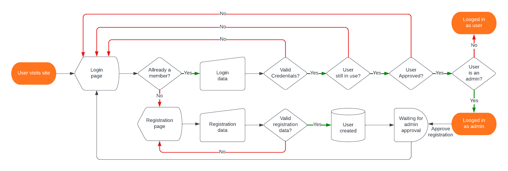

# Consumables Tracker
---
# Description
This is an app for checking an inventory of consumables. It can be used at home or at work. Anybody can be assigned a list of consumables to keep track of. The process can be started by one of the admins either after one user requests it or at a time interval. The inventory can be unlocked either for each user or for all users at the same time.

## Home use case
There are a lot of consumables that need to be tracked at home and easy to forget about. Starting with house consumables (toilet paper, detergent, batteries, light bulbs), kitchen and food related consumables (flour, sugar), kids related (crayons, paper) and personal consumables (toothpaste, soap). Even kids can be assigned a part of the list.

## Work use case
Based on the business, there can be a lot of consumables that you would want to track. Starting with basic things like paper, printer cartridges and office consumables, coffee, sugar and finishing with screws or filters or some other business specifics consumables.

## Language
The app is available in english and romanian, but can also be translated to other languages because of already existing _.pot_ file and _gettext_ methods.

## Schedules
The app includes a group schedule that allows the users to be split in two or more groups and flexible time interval between groups. Also includes an individual schedule where users are rotated on a flexible time interval.

# Live demo

## Website
Follow <https://victorb.eu.pythonanywhere.com> for a working demo. The demo imagines a family inventory with a movie night schedule.

The database resets every day at 04:00 UTC (07:00 EEST Romania time).

## Login credentials
Login credentials:
| username 	| password 	| admin |
|:--------:	|:--------:	|:-----:|
|   Admin  	| .env file	|   x   |
|   user1  	| Q!111111 	|   x   |
|   user2  	| Q!222222 	|   x   |
|   user3  	| Q!333333 	|       |
|   user4  	| Q!444444 	|       |
|   user5  	| Q!555555 	|       |

# Installation

## Install
Clone the [repository](https://github.com/victorBuzdugan/ConsumablesTracker) from GitHub.

## Post install
After cloning install all dependencies from `requirements.txt`

You also have to provide a `.env` file for Flask secret key and [hidden admin](https://github.com/victorBuzdugan/ConsumablesTracker#hidden-admin) password.
Create a new file named `.env` in the root folder:
```python
# Optional Flask debug
# FLASK_DEBUG="true"
FLASK_SECRET_KEY="replace_this_with_secret_key"
ADMIN_PASSW="replace_this_with_hidden_admin_password"
```
You can follow the guide in the [official documentation](https://flask.palletsprojects.com/en/2.3.x/quickstart/#sessions) of Flask in order to generate a good `SECRET_KEY`.

## Database
The project comes with a demo `inventory.db` SQLite database.

Because of the 'closed' environment nature of the app (users need to be approved by an admin after registration), if you edit the database with [sqlite3 command line shell](https://sqlite.org/cli.html) or a software like [DB Browser for SQLite](https://sqlitebrowser.org) be careful to **leave at least one admin user** in the database.

Empty generated databases (delete demo `inventory.db` and run) will be populated with a [hidden admin](https://github.com/victorBuzdugan/ConsumablesTracker#hidden-admin).

## Login credentials
Login credentials for demo `inventory.db` SQLite database are the same as for the [demo website](https://github.com/victorBuzdugan/ConsumablesTracker#login-credentials).


# Help
---
Take a look at the [wiki page](https://github.com/victorBuzdugan/ConsumablesTracker/wiki).

# User
A user is a normal user without administrative rights.

## Authentification

### Registering
Follow the `Register` link in the main menu and provide a username and password (follow the highlighted rules). If the username is available an alert message will tell you that a registration request was sent and you will be redirected to the [login](https://github.com/victorBuzdugan/ConsumablesTracker#login) page.

Contact an admin in order to approve your registration.

### Login
Enter your username and password. If you don't have a registration request pending and the credentials are correct you will be redirected to the main page.

### Change password
Follow the `Change password` link in the main menu. After successfully providing the old password and a new password (follow the highlighted rules) you will be logged out and redirected to the [login](https://github.com/victorBuzdugan/ConsumablesTracker#login) page. An alert message will confirm that your password was changed.

## Inventorying

### Request inventory check
If you see a `Request inventory` button on the main page you can request a inventory check by pressing it. Following the `Inventory` link in main menu will display an alert that you inventory check is not required, the swiches and the submit button will be greyed out.

If you see a yellow `You requested a inventory check` text then it means you sent an inventory request. Following the `Inventory` link in main menu will display an alert that you inventory check is not required, the swiches and the submit button will be greyed out. Contact an admin in order to release inventory check for you.

If you see a red `Check inventory` link on the main page that means you need to check inventory. Click on this link or the `Inventory` link in main menu and proceed with inventorying.

### Inventorying
After an admin has approved inventory check proceed to `Inventory` page by following the link in main menu or the red `Check inventory` link on the main page.
The swiches will not be greyed out and the submit button will display `Submit inventory`. Critical products are displayed in red.

Proceed with inventorying selecting to order only the products that are less than the minimal stock displayed. If all the products assigned to you are above the minimal stock don't select anything. After finishing inventorying press the `Submit inventory` button. You will be redirected to the main page and an alert message will tell you that you successfully submitted the inventory.

## Schedules
On the schedule page users can check the current schedules.

# Admin
An admin is a user with administrative rights.

## Authentification
Authentification is similar to [user authentification](https://github.com/victorBuzdugan/ConsumablesTracker#authentification) with the following difference: an admin requests registration as a 'normal' user and is given administrative rights by another admin in the `Edit user` page.

An admin can also be created by another admin in the `New` -> `User` menu option and checking `Admin` option.


## Main page
On the main page you can look at your user dashboard, admin dashboard and statistics.

### User dashboard
Here you can see some stats about login name, products assigned, schedules information and if you need to check the inventory.

### Admin dashboard
You can see a table of all the users, number of products assigned to them and their status:
- requested registration: this new user requested registration; clicking the red link will [approve registration](https://github.com/victorBuzdugan/ConsumablesTracker#registering) for this user
- requested inventory: this user requested inventorying; clicking the yellow link will approve [inventory check](https://github.com/victorBuzdugan/ConsumablesTracker#request-inventory-check) for this user
- check inventory: this user needs to check inventory; by clicking the blue link you will reach the inventorying page for this user; you can [send the inventory for this user](https://github.com/victorBuzdugan/ConsumablesTracker#inventorying-for-other-user)

If there are products that need to be ordered you will see a red link that will get you to the `Order` page.

In order to start inventory process for ALL users press the `Start Inventorying` button.

### Statistics
Here are a displayed some statistics.


## Inventorying

### Request inventory check
Admins cannot request inventory check. Click on your name in the main page switch `Inventory check` to on and press `Update` button. You can now check inventory.

You should see a red `Check inventory` link on the main page that means you need to check inventory. Click on this link or the `Inventory` link in main menu and proceed with inventorying.

### Inventorying
Inventory check is identical to 'normal' [user inventorying](https://github.com/victorBuzdugan/ConsumablesTracker#inventorying).

### Inventorying for other user
As an admin you can check inventory for all users (admins or not).

On the main page in the [admin dashboard](https://github.com/victorBuzdugan/ConsumablesTracker#admin-dashboard) you can see which user has to check inventory. By clicking the blue link you will reach the inventorying page for this user. Proceed with [inventorying](https://github.com/victorBuzdugan/ConsumablesTracker#inventorying) as usual.

### Inventory check start
You can start inventorying for a single user by clicking his name on the main page admin dashboard, switching `Inventory check` to on and pressing `Update` button. On the main page admin dashboard you can see in this user status the blue link `check inventory`.

In order to start inventorying for ALL users press the `Start Inventorying` button on the main page admin dashboard.


## Users, categories, suppliers, products and order pages
### Users page
All users are displayed on the main page in the admin dashboard.

Clicking on a user name opens the edit user page for this user.

You can also see how many products each user was assigned and a user status as described in [admin dashboard](https://github.com/victorBuzdugan/ConsumablesTracker#admin-dashboard)

### Categories and Suppliers page
You can acces each of the page by selecting the appropiate menu item in the main menu.
Displays a list of all Categories or Suppliers along with details and a statistic of how many products are assigned to each Category or Supplier.

Clicking on a category or supplier name opens the edit page for that element.

### Products page
Selecting Products from the main menu will open the products page.

This displays a list off all products along with details about each one.

You can sort the list by Code(default), Responsable, Category or Supplier by clicking on the corresponding table header.

Clicking on a product name opens the edit page for that product.

### Order page
Selecting Order from the main menu will open the order page.

This displays a list off all products that were checked as needed to be ordered by the users inventorying.

The process is similar to [inventorying](https://github.com/victorBuzdugan/ConsumablesTracker#inventorying) except you check each product you ordered. You can also click the `All ordered` button in the bottom right to check all products.


## New user, category, supplier or product
Select the `New` link in the main menu. Select from the submenu the type of element you want to create (user, category, supplier or product).

Underlined fields are mandatory.

Take note of fields lenght such as product code which must have at least 3 characters but not more than 15.

### New user
To create a new user you must provide at least a unique username and a password. Check also the schedules data. You can provide extra details and decide if this user will be an admin or not.

### New category or supplier
To create a new category or supplier you must provide a unique name. Providing a description is optional.

### New product
In the new product form all fields are mandatory.
Provide a product code, a description, select the responsable, category and supplier for this product, enter a minimum stock, an order quantity and a measuring unit.

Users will check when inventorying if, on the 'shelf', there are less than the value you enter in `minimum stock`. If there are less then they will mark the product as 'to order'. In the orders page you will see the `order quantity` you provided here. If, on the 'shelf', there are a number of this product less than `minimum stock` then we need to order `order quantity`.

Also decide if this is a critical product (critical products will be diplayed in red in the inventory page and products page).

## Edit user, category, supplier or product
You can edit each element by clicking on it's name in the page(users, categories, suppliers, products and order pages).

### In use and delete
Elements that are not in use anymore are displayed with strikethrough text.

The concept of `in use` is similar to delete. They both make the element unusable... For example a retired user can't log in, can't have products attached and so on, or a product that it's not in use anymore won't appear in the inventory list. Obviously deleting an element can't be undone but a retired user can allways be brought back by flipping a switch.

If you are sure that you won't need this element in the (at least) near future (or the pages are filled with strikethrough items) then delete the item
(it's not really that complicated to recreate it in the future). If you are not sure then 'retire' the element by off flipping the in use switch.

All elements (except products) cannot be deleted or retired if they still have products (also retired products) attached to them. If you could delete (or retire) a user then all the product would remain orphan by not having a responsable for inventorying them. In order to delete (or retire) an element you must first reassign all the attached products.

### Edit user
Along with with all the fields presented in [create new user](https://github.com/victorBuzdugan/ConsumablesTracker#new-user) you can switch the inventory check to release inventory for this user as explained in the [inventory check start](https://github.com/victorBuzdugan/ConsumablesTracker#inventory-check-start) and change the user's order in the individual schedule.

### Edit category, supplier
You can edit all the fields as described in [create new category or supplier](https://github.com/victorBuzdugan/ConsumablesTracker#new-category-or-supplier).

You can also reassign all product of this category or supplier to a user by clicking reassign all products. After reviewing all the products that will be modified and selecting the new responsible, confirm the reassignment and all products from this category/supplier will be transferred to the selected user.

### Edit products
Along with with all the fields presented in [create new product](https://github.com/victorBuzdugan/ConsumablesTracker#new-product) you can manually flip the `to order` switch.

# Hidden admin
The _hidden admin_ is a user with administrative rights. He can create and edit elements just like a normal admin but he doesn't appear in any selects (like product responsible), cannot be edited through web interface and doesn't appear in the admin dashboard users table. He is invisible to the other admins.

It's role is as a user with pure administration purposes, like an admin that supervises the app but isn't involved.

It's automatically created when database initialises, with the password provided in the environment variable `ADMIN_PASSW` and with the username `Admin`. The password can be changed just like all other users. All other properties (name, in_use etc) should not be changed as this can lead to unexpected behaviour.

# Extra features
## Unit testing
The app has every feature tested with `pytest`. The tests are provided in the repo. The target coverage of test is 100%.

## Daily tasks
Some platforms like [pythonanywhere](https://eu.pythonanywhere.com) allow usage of scheduled tasks.

The app provides a file (`daily_task.py`) that includes tasks like daily database backup, daily database reinitialization or schedules update.

### Backup function
Makes backups of the database, overwriting the previous backup if it exists. The function also [vacuums](https://www.sqlite.org/lang_vacuum.html) the working database file. The function doesn't just copy the file but instead makes use of [python sqlite3 module backup](https://docs.python.org/3/library/sqlite3.html#sqlite3.Connection.backup).

There are 3 instances of backups:
- a monthly backup
- a weekly backup
- a daily backup

### Re-init function
Reintializes the database to a preset state (as used for the [demo website](https://github.com/victorBuzdugan/ConsumablesTracker#website)). In order to use this function a file with the same name as the database file but with __orig_ suffix has to exist in the working directory (ex: if the database name is `inventory.db` the preset state database name should be `inventory_orig.db`). This function, also doesn't just copy the file but instead makes use of [python sqlite3 module backup](https://docs.python.org/3/library/sqlite3.html#sqlite3.Connection.backup).

### Update schedules function
Checks in the database for schedules that need to be updated by comparing the `Update date` of the schedule with the current date.

## Logging
The app has a logger configured to write to a file some important events from the app. The log file (`logger.log`) is a time rotating file resetting after 30 days and keeping 1 file as backup, practically having almost 2 months of log records.

The log records have timezone configuration and also point to the user that produced the event.

The log level is preset on `DEBUG`.

## Schedules
The app features group schedules allowing the users to be split in two or more groups or individual schedules. You can specify a name, day of the week for the schedule, a day of the week for when to update the schedule, number of groups, group switching interval, wich group should be first and a date for when the schedule should start.

The demo website features a "Saturday movie" schedule in wich users are split in two groups, with saturday as a scheduled day, monday for the day when the schedule should update and a group switching interval of one week and a "Cleaning schedule" where users are rotated weekly.

## Guide page
A guide page for presenting general guidelines, rules and other informations.

# Flowcharts
### User login/registration


